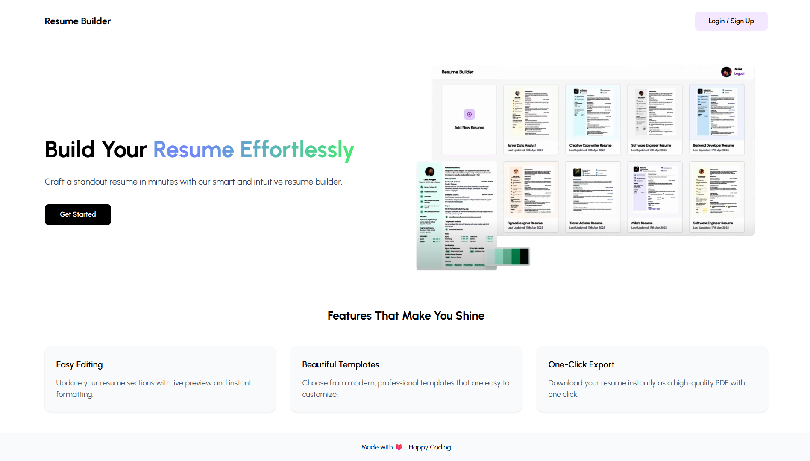
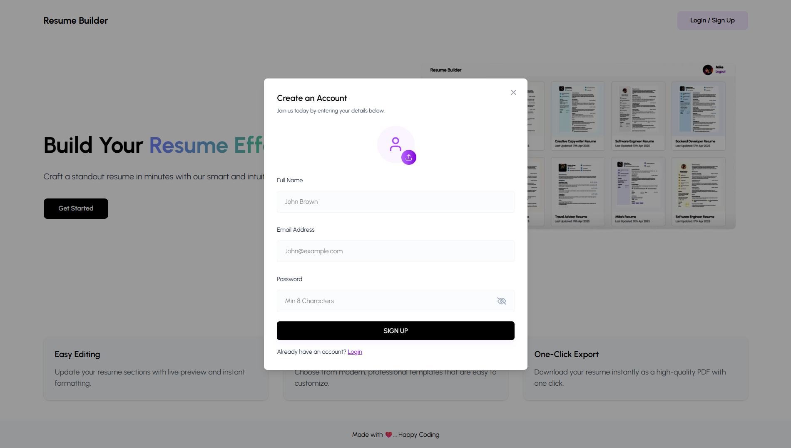
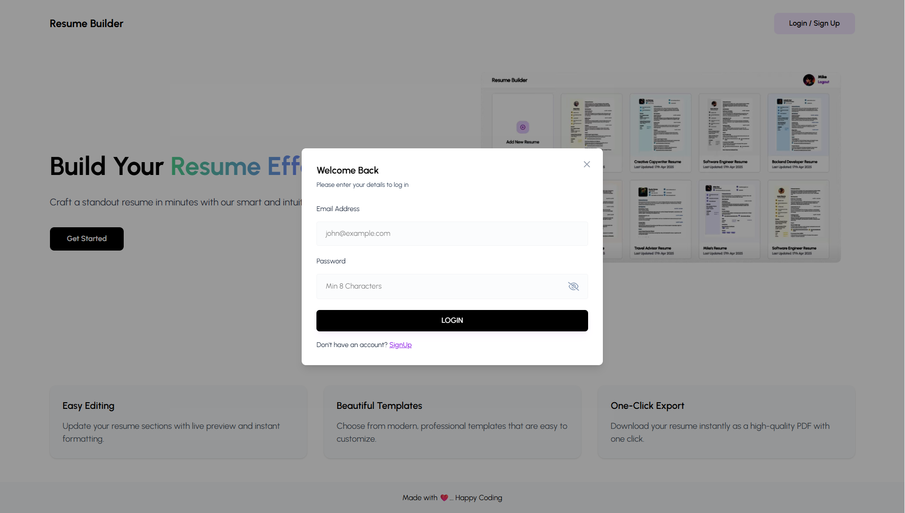
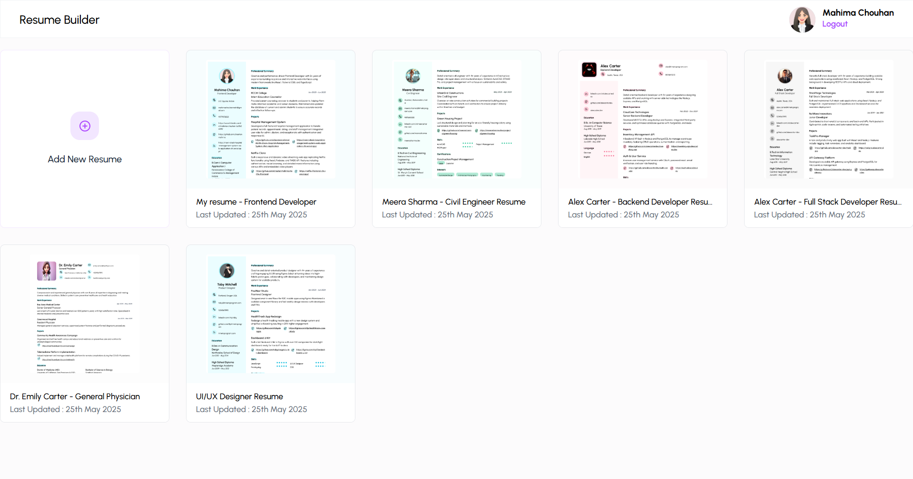
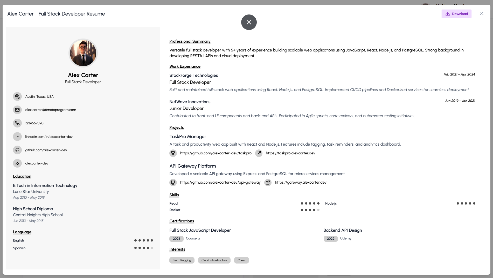
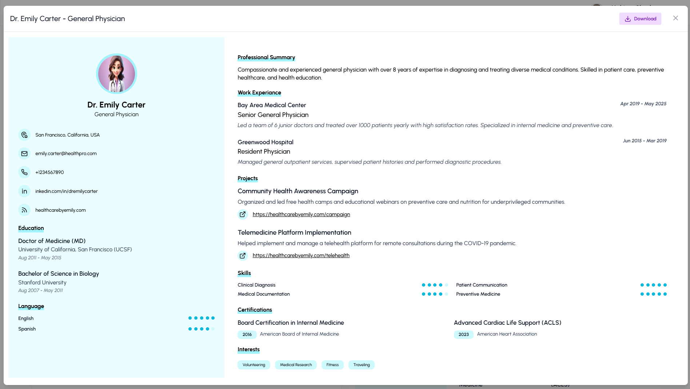
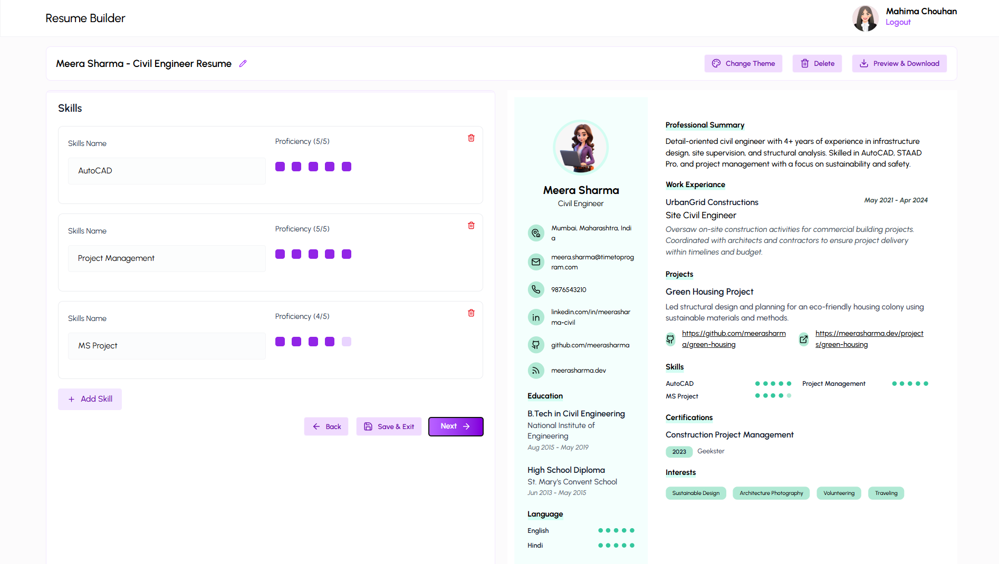

# 📄 Resume Builder App (MERN Stack)

A modern, feature-rich web application that allows users to craft professional resumes with ease. Built using the powerful **MERN stack** (MongoDB, Express.js, React.js, and Node.js), this app enables users to design, edit, and download resumes using customizable templates and color palettes — all within a real-time preview environment.

---

## 🖼️ Images
- Home Page



- Signup



- Login



- Dashboard



- Content - 1



- Content - 2



- Update Resume



---

## 🌟 Features Overview

### 🔐 User Authentication
- Secure user registration and login using **JSON Web Tokens (JWT)**.
- Persistent session management to keep users logged in.

### 🗂️ Resume Dashboard
- Organized dashboard showing all saved resumes.
- Easily **edit**, **delete**, or **download** existing resumes.

### 📝 Live Resume Editor
- Real-time form-based editor to input personal details, education, skills, experience, etc.
- Instantly preview changes on the right pane while editing on the left.

### 🎨 Template Switching
- Choose from various professional resume templates.
- Dynamically swap templates without losing your data.

### 🌈 Color Palette Selector
- Pick from preset or custom colors to personalize your resume's look.

### 🖼️ Image Upload & Preview
- Upload and display a profile photo in real-time.
- Supports drag-and-drop and file selection.

### 📥 PDF Download
- Convert your resume into a polished PDF document with one click.
- Maintains formatting and layout in the export.

### 💾 Save & Manage Resumes
- Save multiple resumes securely to your account.
- Update your resumes anytime in the future.

### 🌐 Backend API Integration
- Fully-featured REST API built with Express.js and MongoDB.
- CRUD operations: Create, Read, Update, and Delete resumes securely.

---

## 🛠 Tech Stack

| Layer        | Technology             |
|--------------|------------------------|
| Frontend     | React.js, Tailwind CSS |
| Backend      | Node.js, Express.js    |
| Database     | MongoDB Atlas          |
| Auth         | JWT, bcryptjs          |
| PDF Export   | html2pdf.js / react-to-pdf |
| File Upload  | Multer / Cloudinary (optional) |

---

## 🚀 Getting Started

### 🔧 Prerequisites

- Node.js (v14+)
- MongoDB Atlas account or local MongoDB
- npm or yarn

### 📦 Installation

```bash
# Clone the repo
git clone https://github.com/mahimachouhan/Resume-Builder-App
cd resume-builder
```

```bash
# Install backend dependencies
cd server
npm install
```

```bash
# Create a .env file in /server with the following:
MONGO_URI=your_mongodb_connection_string
JWT_SECRET=your_secret_key
PORT=3030
```

```bash
# Start the backend
npm run dev
```

```bash
# Install frontend dependencies
cd ../frontend
npm install
```

```bash
# Start the frontend
npm start
```
---

## 📁 Project Structure

```csharp
resume-builder/
├── frontend/              # React Frontend
│   ├── public/
│   └── src/
│       ├── components/  # Reusable UI components (Forms, Preview, Templates)
│       ├── pages/       # Pages (Login, Register, Dashboard, Editor)
│       ├── redux/       # Redux store & slices (if using Redux)
│       └── utils/       # Helper functions
│
├── backend/              # Express Backend
│   ├── models/          # Mongoose models (User, Resume)
│   ├── routes/          # Express routes (auth, resume)
│   ├── controllers/     # Logic for route handlers
│   ├── middleware/      # JWT auth, error handling
│   └── config/          # DB connection
│
├── README.md
└── package.json
```
---

## 🫱🏼‍🫲🏽 Dependencies

```csharp
Frontend-dependencies : {
    "@tailwindcss/vite": "^4.1.5",
    "axios": "^1.9.0",
    "html2canvas": "^1.4.1",
    "moment": "^2.30.1",
    "react": "^19.0.0",
    "react-dom": "^19.0.0",
    "react-hot-toast": "^2.5.2",
    "react-icons": "^5.5.0",
    "react-router-dom": "^7.5.3",
    "react-to-print": "^3.1.0",
    "tailwindcss": "^4.1.5"
}
```

```csharp
Backend-dependencies : {
    "bcryptjs": "^3.0.2",
    "cors": "^2.8.5",
    "dotenv": "^16.5.0",
    "express": "^5.1.0",
    "jsonwebtoken": "^9.0.2",
    "mongoose": "^8.14.1",
    "multer": "^1.4.5-lts.2"
}
```

---

## 💡 Future Improvements

- ✉️ Resume Sharing via public links

- 📆 Auto-save draft resumes

- 🌙 Dark Mode support

- 🧠 AI-powered suggestions for content

- ⏳ Resume edit history/versioning

---

## 🚀 Live Link

- Hosted Link 👇🏼

    [Click Me](https://resume-builder-app)


- Github Repo 👇🏼

    [Click Me](https://github.com/mahimachouhan/Resume-Builder-App.git)

---

## 📬 Contact

Developer: `Mahima Chouhan`

GitHub: `https://github.com/chouhanmahima`

LinkedIn: `https://www.linkedin.com/in/mahima-chouhan-ba9b56201/`

Email: `mahimachouhanmahi@gmail.com`

---

## 📜 License

This project is licensed under the MIT License.